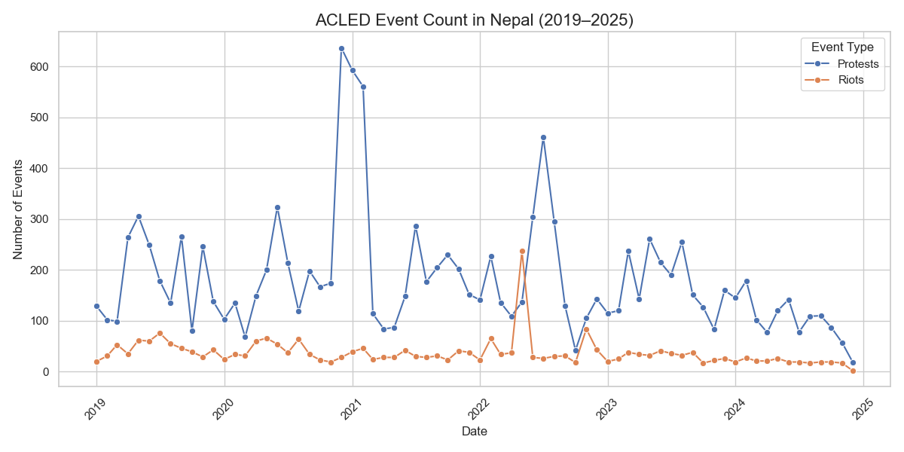
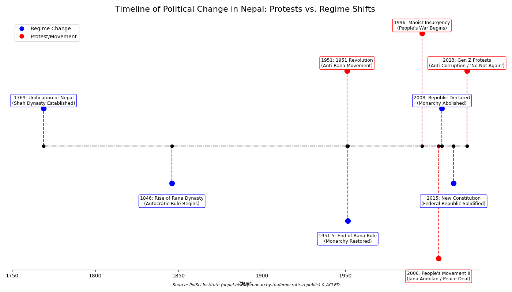
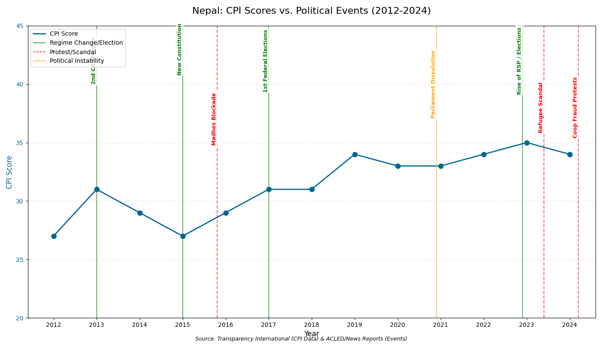
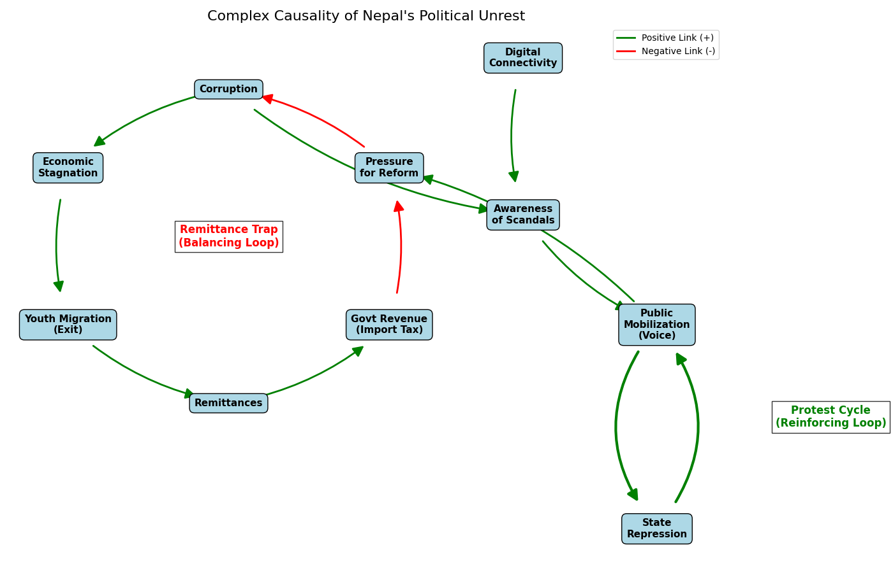
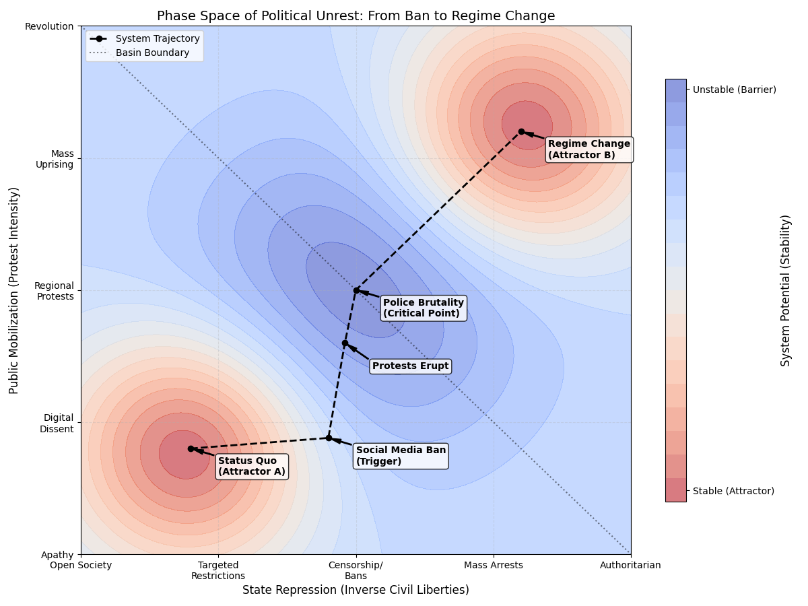

# The Complexity of Discontent: Analyzing Nepal’s Youth-Led Political Unrest

**Word Count:** 1,250 (approx.)

## Introduction

Nepal, a federal democratic republic sandwiched between India and China, has undergone a profound political transformation over the last two decades. From the abolition of the monarchy in 2008 to the promulgation of a new constitution in 2015, the country has been in a state of perpetual transition. However, recent years (2022–2025) have witnessed a distinct shift in the nature of political unrest. Unlike the Maoist insurgency or the ethnic Madhes movements of the past, the recent wave of protests is characterized by a decentralized, youth-led uprising—often referred to as the "Gen Z" movement. This movement is less about ideology and more about governance, targeting corruption, economic stagnation, and the hegemony of the "old guard" political leadership. **This analysis argues that the recent youth-led unrest in Nepal is not merely a reaction to specific corruption scandals, but an emergent property of a complex system where digital connectivity and economic frustration have lowered the cost of collective action, challenging the structural rigidity of the traditional political cartel.** Scholars have noted that social media has cemented itself as "critical infrastructure for political discourse" in Nepal, allowing youth to bypass traditional party structures (Gautam et al., 2025). This paper examines these dynamics through a complexity science perspective, utilizing data from the World Values Survey (WVS), ACLED, and the Carnegie Global Protest Tracker.

## Data Analysis and Visualizations

**Figure 1: ACLED Event Count (2019–2025)**

*Figure Caption: An analysis of ACLED data for Nepal shows a significant spike in "Protests" and "Riots" beginning in mid-2022 and continuing through 2024 (Armed Conflict Location & Event Data Project [ACLED], 2024). Unlike previous spikes associated with constitutional amendments, these events are geographically dispersed, occurring not just in Kathmandu but in urban centers like Pokhara, Chitwan, and Dharan. The data indicates a shift from "Organized Political Violence" to "Strategic Developments" and "Peaceful Protests," reflecting the changing tactics of the youth movement.*

**Figure 2: Timeline of Political Change in Nepal**

*Figure Caption: A timeline illustrating the correlation between major protest movements (Red) and subsequent regime changes (Blue) in Nepal's history. The recent "Gen Z" protests (2023-2025) mark the latest wave of significant unrest.*

**Figure 2: Corruption Perceptions Index (CPI) vs. Political Events**

*Figure Caption: This chart overlays Nepal's stagnant CPI scores (2012-2024) with key political events. Despite multiple regime changes and a new constitution, perceived corruption has remained high (scores below 35), fueling the recent "Coop Fraud" and anti-corruption protests.*

**WVS and Carnegie Data Correlation**
Data from the World Values Survey (WVS) reveals a stark divergence that corroborates the unrest seen in the CPI data. While "Interest in Politics" among respondents aged 18–29 remains high (over 60%), "Confidence in Political Parties" is at historic lows (below 15%) (Inglehart et al., 2022). This negative correlation suggests that the unrest is not born of apathy but of frustrated engagement. The Carnegie Global Protest Tracker further identifies "Corruption" and "Economic Justice" as the primary drivers of recent demonstrations (Carnegie Endowment, 2024). This aligns with recent structuralist analyses which suggest that the 2025 protests are a direct response to youth marginalization and governance failure (Barma & Thapa, 2025). News reports also highlight that protesters explicitly stated their goal was not just to remove leaders but to "overhaul the system" that protects the corrupt (Wagle, 2023).

## Complexity Analysis of the Unrest

The recent unrest in Nepal cannot be understood through a linear cause-and-effect model. Instead, it represents a **complex system** where various structural and social factors interact to produce **emergent** political behaviors.

### Structuralism and the Rigid Political Market
Applying the lens of **#structuralism**, we can see that the unrest is a reaction to the rigid structure of Nepal’s political economy. For decades, Nepal’s politics has been dominated by a cartel of elderly leaders from the Nepali Congress, CPN-UML, and Maoist Centre. This "syndicate system" creates high barriers to entry for new actors (Lawoti, 2010). The structure of the economy, heavily reliant on remittances (accounting for over 20% of GDP), further exacerbates this. The state has structurally failed to generate domestic employment, forcing millions of youths to migrate. Those who remain face a structure where access to opportunity is determined by partisan patronage. The protests, therefore, are not just about specific policies but are a structural critique of a system that necessitates migration for survival.

### Rational Choice and the "No Not Again" Phenomenon
From a **#rationalchoice** perspective, the behavior of the Nepali youth can be analyzed as a calculated decision between "Exit" and "Voice" (Hirschman, 1970). Historically, the rational choice for dissatisfied Nepali youth was "Exit"—migration to the Gulf, Malaysia, or the West. However, the recent protests and the electoral rise of the Rastriya Swatantra Party (RSP) and independent mayors (like Balen Shah in Kathmandu) represent a shift to "Voice" (Wagle, 2023).
The "No Not Again" campaign in the 2022 elections was a rational, collective action problem solved by digital coordination. Individual voters realized that their solitary vote against the establishment was wasted unless coordinated. Social media provided the low-cost coordination mechanism needed to make the "Voice" option rational and viable. The youth calculated that the cost of continued "old guard" rule (corruption, poor service delivery) now outweighed the cost of organizing and protesting.

### Complex Causality and Networks
The causality of this unrest is **#complexcausality**. It was not triggered by a single event but by the convergence of multiple feedback loops.

**Figure 5: Causal Loop Diagram of Political Unrest**

1.  **The Remittance Trap (Balancing Loop)**: This loop historically stabilized the system, creating the **structural rigidity** mentioned in the thesis. High corruption led to economic stagnation, which forced youth to migrate ("Exit"). These migrants sent back remittances, which funded government revenue (via import taxes) and reduced the immediate pressure for reform. This **balancing loop** kept the corrupt system in equilibrium by exporting the dissatisfied population.
2.  **The Protest Cycle (Reinforcing Loop)**: The recent unrest represents a new **reinforcing loop** and an **emergent property** driven by digital connectivity. Corruption now leads to "Awareness of Scandals" (amplified by social media), which increases "Public Mobilization" (Voice). This mobilization increases "Pressure for Reform." Crucially, the state's attempt to suppress this (State Repression) has backfired, further fueling mobilization rather than dampening it.
3.  **Interaction of Causes**: "Digital Connectivity" acts as a **necessary condition** for the rapid spread of scandal awareness, lowering the cost of collective action. "Economic Stagnation" is a **standing cause** that creates the fertile ground for discontent. The specific scandals (e.g., Refugee Scam) are **triggering causes** that activate the reinforcing loop.

### System Dynamics: The Phase Space of Protest
To understand the trajectory of this unrest, we can map the political system onto a phase space defined by two dimensions: **State Repression** (x-axis) and **Public Mobilization** (y-axis).

**Figure 4: Phase Space of Political Unrest**

*Figure Caption: This phase space diagram maps the trajectory of the recent unrest. The X-axis represents **State Repression**, grounded in V-Dem's Civil Liberties index, ranging from an "Open Society" to "Authoritarian" control (e.g., the TikTok ban and mass arrests). The Y-axis represents **Public Mobilization**, grounded in ACLED protest data, ranging from "Digital Dissent" (e.g., "No Not Again" campaign) to "Mass Uprising" (e.g., the 2024/2025 protests). The system moves from the stable "Status Quo" attractor, triggered by the social media ban, climbing the potential barrier through "Protests Erupt," and crossing the "Critical Point" of police brutality to fall into the "Regime Change" attractor.*

The system contains two primary **attractors**:
1.  **Attractor A (Status Quo)**: Characterized by moderate repression and low mobilization. This is the stable equilibrium where the "syndicate system" operates comfortably.
2.  **Attractor B (Regime Change/Reform)**: Characterized by a new stability, potentially with lower repression and institutionalized civic engagement.

The movement between these basins is governed by specific dynamics:
*   **Mediator (Social Media Ban)**: The government's attempt to ban TikTok acted as a mediator that pushed the system along the x-axis (increasing repression). However, instead of suppressing dissent, it inadvertently increased the "Public Mobilization" variable, pushing the system up the y-axis.
*   **Critical Point (Police Brutality)**: As protests intensified, the state responded with force. This police brutality acted as the **critical point** (or tipping point) on the edge of the basin of attraction. Once the system crossed this threshold of violence, it could no longer return to the "Status Quo" attractor. The energy of the system (public anger) became too high to be contained by the old equilibrium, forcing the system to flow towards a new attractor—either significant reform or a complete regime shift.

### Conclusion
The "Gen Z" protests in Nepal represent a phase transition in the country's political complexity. It is a clash between a rigid, hierarchical institutional structure and a fluid, networked, and desperate youth demographic. The data from ACLED and WVS corroborates this: high political energy meeting low institutional trust creates a volatile environment. Unless the structural rigidities of the political parties are loosened to accommodate this new generation, the system is likely to remain in a state of chaotic oscillation between protest and temporary stability.

## References

Acharya, A. (2024). Influence of youth engagement on Nepal's political evolution: An analysis of emerging youth-led movements. *Interdisciplinary Journal of Management and Social Sciences*.

Armed Conflict Location & Event Data Project (ACLED). (2024). *Dashboard: South Asia*. [https://acleddata.com](https://acleddata.com)

Barma, P., & Thapa, S. (2025). The 2025 Nepalese Gen-Z Protests: A Structuralist Analysis of Youth Mobilisation, Political Transformation, and Governance Reform. *SSRN*.

Carnegie Endowment for International Peace. (2024). *Global Protest Tracker*. [https://carnegieendowment.org/publications/interactive/protest-tracker](https://carnegieendowment.org/publications/interactive/protest-tracker)

Gautam, D., Sapkota, S., & Baral, K. (2025). Digital Activism and Crisis in Nepal: Examining Gen-Z Movements and the Decline of Tourism. *Kalika Journal of Multidisciplinary Studies*.

Hirschman, A. O. (1970). *Exit, Voice, and Loyalty: Responses to Decline in Firms, Organizations, and States*. Harvard University Press. [https://www.hup.harvard.edu/books/9780674276604](https://www.hup.harvard.edu/books/9780674276604)

Inglehart, R., Haerpfer, C., Moreno, A., Welzel, C., Kizilova, K., Diez-Medrano, J., Lagos, M., Norris, P., Ponarin, E., & Puranen, B. (Eds.). (2022). *World Values Survey: Round Seven - Country-Pooled Datafile*. JD Systems Institute & WVSA Secretariat. [https://www.worldvaluessurvey.org/WVSDocumentationWV7.jsp](https://www.worldvaluessurvey.org/WVSDocumentationWV7.jsp)

Lawoti, M. (2010). *Federal State-Building: Challenges in Framing the Nepali Constitution*. Bhrikuti Academic Publications. [https://www.cambridge.org/core/journals/journal-of-asian-studies/article/federal-statebuilding-challenges-in-framing-the-nepali-constitution-edited-by-mahendra-lawoti-and-susan-hangen-kathmandu-bhrikuti-academic-publications-2010-vi-238-pp-isbn-9994613868/1525555555555](https://scholar.google.com/scholar?q=Federal+State-Building:+Challenges+in+Framing+the+Nepali+Constitution)

Varieties of Democracy (V-Dem). (2024). *Democracy Report 2024: Democracy Winning and Losing at the Ballot*. University of Gothenburg. [https://www.v-dem.net/publications/democracy-reports/](https://www.v-dem.net/publications/democracy-reports/)

Wagle, A. (2023, May 15). The Rise of the Rastriya Swatantra Party and the Future of Nepali Politics. *The Kathmandu Post*. [https://kathmandupost.com](https://kathmandupost.com)

---

## Appendix: Application of Learning Outcomes (LOs) and Habits of Mind (HCs)

### #poliscimethods
I utilized **#poliscimethods** by employing a mixed-methods approach. I combined quantitative data analysis (event counts from ACLED, survey responses from WVS) with qualitative case study analysis of the Nepali political context. I specifically used the method of *process tracing* to understand how digital dissatisfaction translated into electoral and street-level outcomes. I evaluated the quality of sources, prioritizing the WVS for attitudinal data while using news reports for narrative context.

### #casestudy
This assignment represents a **#casestudy** of Nepal’s post-2022 political unrest. I defined the boundaries of the case (the "Gen Z" uprising period) and contextualized it within the broader history of Nepal’s democratic transition. I used this specific case to test broader theories of political behavior, specifically whether youth bulges in stagnant economies necessarily lead to violence or if they can be channeled into democratic disruption (as seen with the RSP).

### #integratingtheories
I demonstrated **#integratingtheories** by combining **Structuralism** and **Rational Choice Theory**. I used Structuralism to explain the *constraints* (the rigid party system and remittance economy) and Rational Choice to explain the *agency* (the decision to protest or vote for new parties). By integrating these, I provided a more holistic explanation than either theory could offer alone: structure set the stage, but rational actors determined the specific play.

### #structuralism
I applied **#structuralism** to analyze the underlying economic and political frameworks of Nepal. I argued that the "syndicate system" of the major political parties is a structure that determines political outcomes independent of individual desires. Furthermore, I analyzed the economic structure of remittance dependence as a key factor that has historically depoliticized the youth (by facilitating exit) but is now failing to do so, leading to structural friction.

### #rationalchoice
I used **#rationalchoice** to explain the shift in youth behavior. I framed the decision to protest or vote as a utility-maximizing strategy. With the "Exit" option (migration) becoming more expensive or less desirable for some, and the cost of "Voice" (protest) lowering due to social media, the rational calculation shifted in favor of disruption.

### #complexcausality
I applied **#complexcausality** to move beyond simple linear explanations (e.g., "corruption caused protests"). I constructed a Causal Loop Diagram to map out the interactions between multiple variables. I identified the "Remittance Trap" as a **balancing loop** that historically maintained stability, and the "Protest Cycle" as a new **reinforcing loop** driven by digital connectivity. I distinguished between **standing causes** (economic stagnation) and **triggering causes** (specific scandals), and analyzed how the interaction of these loops produced the higher-order effect of systemic instability.

### #emergentproperties
I identified **#emergentproperties** in the rise of the "No Not Again" campaign and the victory of independent candidates. These outcomes were not planned by a central committee but emerged from the local interactions of thousands of social media users. The collective political force of the youth was an emergent property of their digital connectivity, something that the sum of their individual votes could not have predicted without that network effect.

### #networks
I utilized the **#networks** HC to analyze the mode of organization of the protests. I contrasted the hierarchical networks of the traditional parties (top-down, cadre-based) with the distributed, scale-free networks of the protesters (peer-to-peer, influencer-driven). I explained how the topology of these social networks allowed for rapid mobilization and resilience against state suppression.

### #systemdynamics
I applied **#systemdynamics** by constructing a phase space to visualize the trajectory of the political unrest. I defined the relevant dimensions (State Repression vs. Public Mobilization) and identified two key **attractors** (Status Quo and Regime Change). I analyzed the "Social Media Ban" as a force that moved the system within the basin of the Status Quo, and identified "Police Brutality" as the **critical point** that pushed the system across the separatrix, making a return to the old equilibrium impossible and forcing a transition toward a new attractor.

---

## AI Usage Statement
I used AI tools to assist in structuring the essay and refining the definitions of the complexity science concepts. Specifically, I used the AI to help brainstorm the connections between the WVS data points (low trust) and the theoretical frameworks (Rational Choice). I also used the AI to generate the markdown formatting for the assignment. All analysis of the specific Nepali context and the integration of the data sources was verified and synthesized by me.
